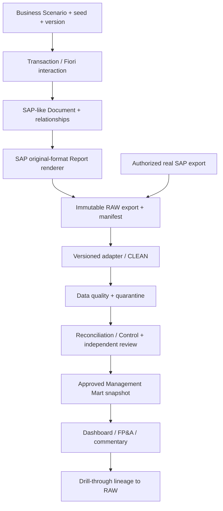

# Kiến trúc SAVA SAP S/4HANA Manufacturing Simulator



## Hai provenance độc lập

`SIMULATED` được tạo từ event/document store với scenario seed, ruleset version và oracle. `SAP_EXPORT` có system/client/edition/release, extraction operator và file thật. Không trộn hai loại trong cùng approved dataset. File do simulator tạo có badge mô phỏng trong UI/manifest; không chèn cột kỹ thuật vào bảng RAW nếu layout không có cột đó.

Original-format có nghĩa tái tạo layout cụ thể được Finance SME duyệt: tiêu đề, selection, cột/thứ tự, format số/ngày, totals, export type. Chưa có sample thì chỉ là proposed layout. Report là projection theo selection và cutoff trên documents, không phải một bảng KPI tự thiết kế rồi đổi tên MB51.

## Ranh giới thành phần

- Frontend hiện tại: Learn/scenario/transaction/classic/Fiori navigation. Thêm report browser và Data Lab; giữ reusable BOM/ledger panels.
- Domain engine TypeScript: document events, posting policies, costing/valuation profiles, reversal relationships. Tách hàm tính khỏi React qua interfaces; migration từng module.
- Report renderer: projection + layout profile + export serializer. Không chứa cleaning business rules.
- Ingestion service/worker: storage/hash/manifest; adapter registry; DQ; replay. Backend thực thi quyền và trạng thái.
- Control engine: paired snapshot scope, deterministic rules, evidence và exception workflow.
- Mart publisher: chỉ publish snapshot có control/approval; UI truy API read-only theo snapshot id.
- AI tutor/commentary: chỉ đọc context được lọc; mọi đề xuất có facts/rule ids; không là engine tính số, không duyệt control.

## Entity và cardinality

| Entity | Khóa / quan hệ | Quy tắc |
|---|---|---|
| scenario / scenario_run | scenario_id + version; run UUID | Seed cố định, ruleset immutable; branching tạo run mới |
| business_document / document_item | source namespace + type + fiscal scope + number + item | Document type phân biệt production/PO/material/FI/billing; không dùng số chứng từ đơn lẻ |
| document_link | from item, to item, link_type, allocation | Many-to-many cần allocation và completeness; không join đại theo ngày/số tiền |
| production_order | source_system + client + production_order | Components/operations/confirmations là child, không flatten cross-product |
| report_run / raw_object | UUID; raw hash | Một raw có nhiều processing run; selection/cutoff là bắt buộc |
| clean_dataset / clean_row | dataset id + natural key; row lineage | Snapshot mới không overwrite snapshot cũ |
| quality_issue | issue id + row/rule version | Severity, source coordinate, remediation disposition |
| reconciliation_run / exception | scope + rule version + input dataset ids | Kết quả chạy lại không sửa evidence cũ |
| approval | actor + timestamp + artifact hash + role | Author != approver; revoke sinh event mới |
| mart_snapshot / mart_row_lineage | snapshot id + grain keys | DAG nối nguồn/control/approval, không tự tổng hợp từ RAW |

Namespace `source_system, client` có trên mọi business key; `snapshot_id/run_id` chỉ thêm ở physical storage cho snapshot, không làm duplicate business key trở nên hợp lệ. GL view dùng ledger/document line; FI entry view có business key khác, phải nối bằng bridge.

## Cấu trúc thư mục đề xuất trong repo hiện tại

```text
D:\sava-erp-simulator\
  src/                         # giữ code hiện có
    domain/ reports/ dataLab/ controls/ analytics/  # chỉ đề xuất cho các PR tiếp theo
  server/ingestion/ workers/    # thêm khi ADR runtime được duyệt
  contracts/                   # production contracts sau review; bản draft hiện ở docs/implementation/contracts
  config/variants/ rules/       # không chứa secrets
  tests/fixtures/synthetic/ golden/ integration/ e2e/
  scripts/                     # giữ parity.ts; thêm replay/validate khi triển khai
  docs/implementation/         # bộ tài liệu tạo trong tác vụ này
  data-local/                  # development only, cần ignore khi tạo
    raw/ clean/ control/ mart/ quarantine/
```

Production RAW trên private object storage, metadata/control trên PostgreSQL là đề xuất. Không ghi production RAW vào Git, public Netlify assets hay localStorage. Development có thể dùng filesystem + SQLite qua cùng repository interface; cutover phải rehearsal bằng migration và replay. Không dùng ephemeral function filesystem làm kho chính.

## Management mart — grain và publication contract

| Fact / dimension đề xuất | Grain | Measures / lineage |
|---|---|---|
| fact_mfg_order_period | snapshot + namespace + company + plant + order + period + currency_type + currency + cost_basis_version | actual/target/variance/explained/residual; delivered/consumed chỉ khi UoM phù hợp; input_dataset_ids/control_run_ids |
| fact_mfg_component_usage | snapshot + order + reservation/item + period + material + base_uom | allowed_qty/net_issue/usage_variance; standard-price reference và costing version |
| fact_ap_open_item / fact_ar_open_item | snapshot key date + namespace + company + fiscal_year + FI document/item + currency view | signed balance/due_date/days_overdue/aging_bucket; special-GL class |
| fact_inventory_period | snapshot + namespace + valuation_area/type + material + period + currency_type/view | beginning/receipts/consumption/ending/price_diff/PUP; no cross-valuation sums |
| fact_billing_item | snapshot + namespace + billing document/item + currency | net sales/tax/cancellation class; accounting bridge ids |
| dim_material / dim_account / dim_partner / dim_org / dim_calendar | namespace + business key + effective_from/version | Effective-dated attributes; historical facts retain matching dimension version |

Mỗi mart row có `lineage_id`, `quality_status`, `approval_id`; snapshot có `published_at`, `as_of`, `rules_version`, `supersedes_snapshot_id`. KPI query phải filter đúng snapshot và currency/valuation/cost basis. Không sum cùng fact qua nhiều snapshots; không aggregate header measures sau join components 1:N.

Metric registry bắt buộc: metric_id/version, business definition, fact/grain, numerator, denominator, inclusions/exclusions, units, null/zero policy, cutoff, approved control dependencies và reviewer. DSO/DPO/DIO dùng average balance đầu/cuối kỳ hoặc daily average nếu policy có data; công bố phương pháp và không so hai kỳ khác phương pháp âm thầm. Overdue ratio = eligible overdue balance / eligible total balance; credit balances treatment do policy quy định.

KPI stale khi upstream bị superseded/revoked hoặc cutoff khác kỳ hiển thị. Publication service chỉ chuyển pointer khi tất cả required controls approved cùng input dataset set; approval cho tập dữ liệu cũ không chuyển sang tập mới tự động.
